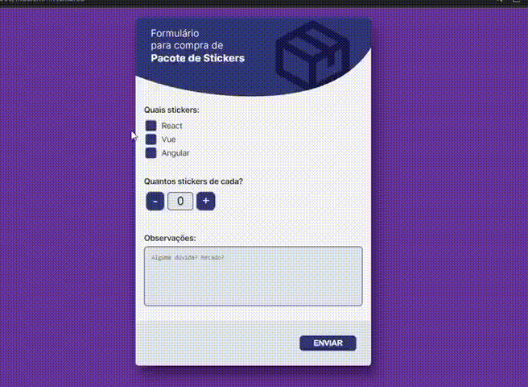

# Desafio Front-end

No nosso dia-a-dia, temos alguns desafios, como desenvolver componentes, aplicações, lidar com prazos e etc. Mas sabe o que é um desafio de verdade? Manter um código bom mesmo com situações corriqueiras 💩. 

Realizei esse teste que simula situações descritas acima. E tem com o objetivo aferir conhecimentos diversos do universo básico de front-end: HTML, CSS, Javascript, semântica, acessibilidade, componentização…

Ele foi separado em etapas.

## Layout

> FIGMA :
[Aqui](https://www.figma.com/file/Ly86lgfa2qYMB1mV1FYpLEQT/frontend-test?node-id=0%3A2)

## Código
Foi utilizado JavaScript, HTML e CSS.

HTML semântico, com tags que correspondem corretamente aos cenários aplicados.

Fiel ao layout.

HTML acessível.

Componente de contador para definir a quantidade de stickers que deseja comprar. 

Foram feitas validações de formulário para ajudar o usuário a não se perder durante o envio das informações  necessárias.

----

    

